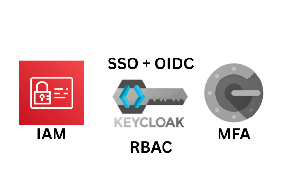
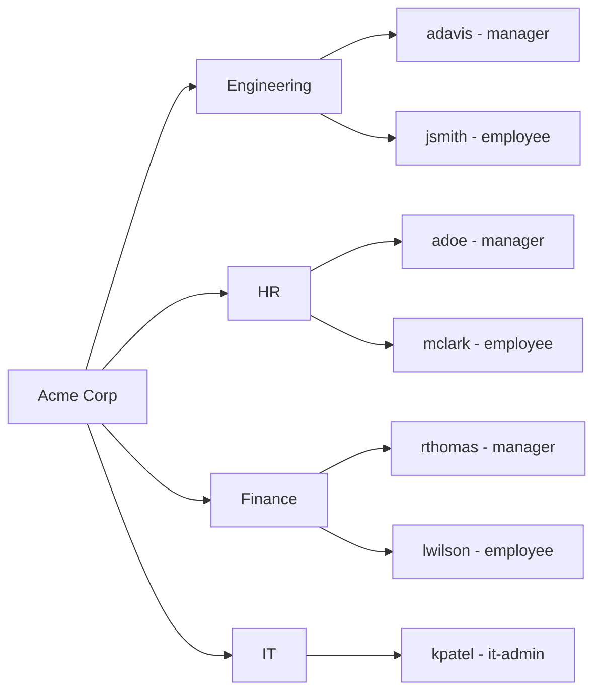

# Keycloak IAM Development Lab



A hands-on IAM platform implementation for a fictional organization (Acme Corp), built as a practical follow-up to the [TATA Cybersecurity Analyst - IAM Developer virtual internship via Forage](https://www.theforage.com/completion-certificates/ifobHAoMjQs9s6bKS/gmf3ypEXBj2wvfQWC_ifobHAoMjQs9s6bKS_69a0eaeeb1f8e4b8685709b8_1772548764230_completion_certificate.pdf).

**Full write-up:** [dev.to/shobanchiddarth/iam-development-lab-in-keycloak-19i7](https://dev.to/shobanchiddarth/iam-development-lab-in-keycloak-19i7)

## What this lab covers

- Keycloak 26.5.6 deployed on Debian with TLS via mkcert local CA
- Mailpit for local SMTP (email verification, password reset)
- Acme Corp org structure: 4 departments, 3 roles, 7 users
- RBAC via Keycloak realm roles
- MFA via TOTP (Google Authenticator)
- SSO via OIDC
- Password policy + brute force protection
- Employee lifecycle: provisioning, role change, account disable/enable, deletion
- Audit logging (login events + admin events)

## Organization Structure


## Repo Structure
```
keycloak-server/        - keycloak.conf and other server-side config
systemd/                - keycloak.service and mailpit.service unit files
acme-realm-export.json  - full Acme Corp realm export (roles, groups, clients, auth flows)
```

## Importing the Realm

1. In Keycloak admin console, go to **Create realm**
2. Click **Browse** and select `acme-realm-export.json`
3. Click **Create**

This restores the full Acme Corp realm config including roles, groups, clients, authentication flows, and password policy. Users are not included in the export - those need to be created manually.


## Prerequisites

- [pfSense VM intercommunication setup](https://dev.to/shobanchiddarth/the-superior-way-to-make-vms-communicate-with-each-other-as-well-as-host-with-internet-access-42m1)
- [Pi-hole for local DNS](https://dev.to/shobanchiddarth/setting-up-pi-hole-as-a-custom-dns-server-on-my-home-lab-4jd7)
- [mkcert local CA for TLS](https://dev.to/shobanchiddarth/setting-up-ssl-https-on-my-home-lab-g45)
